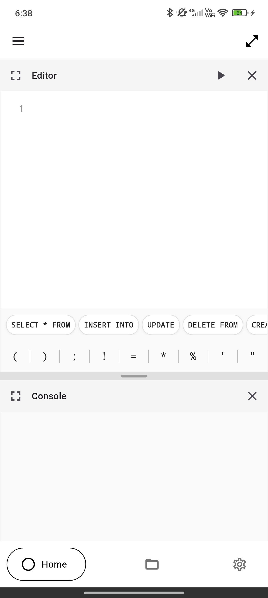
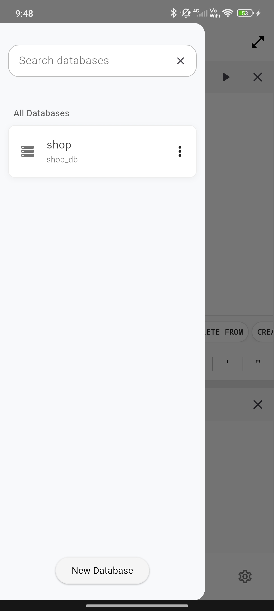
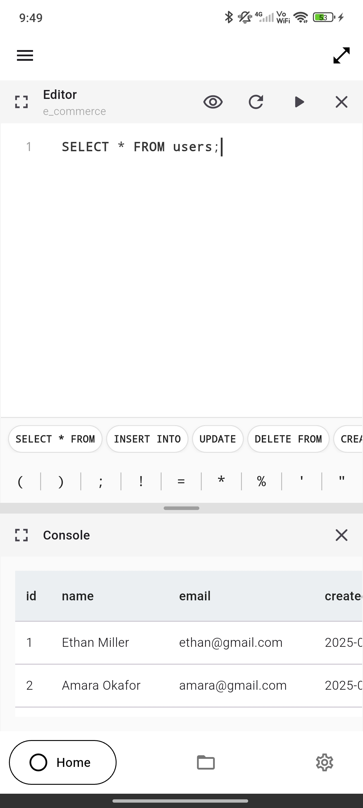
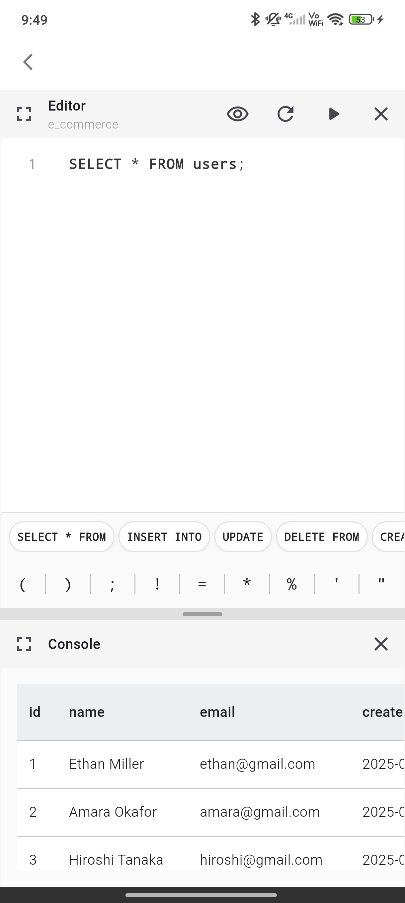
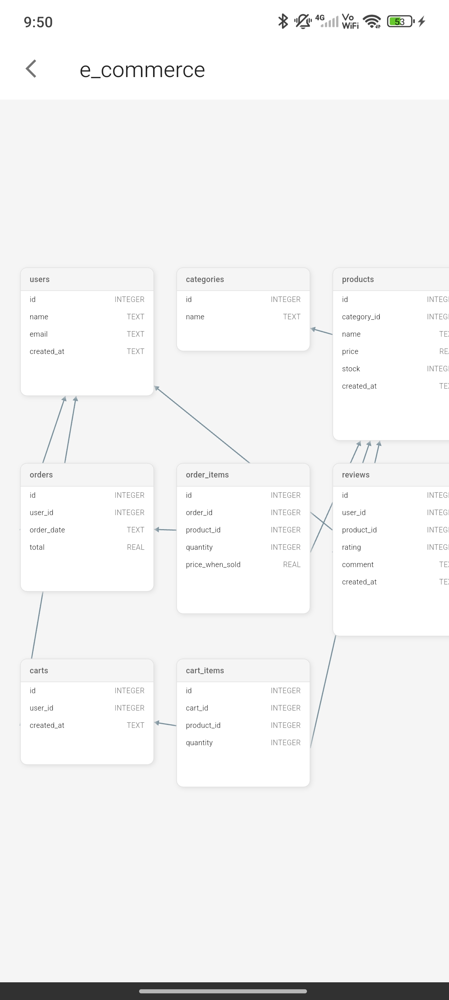
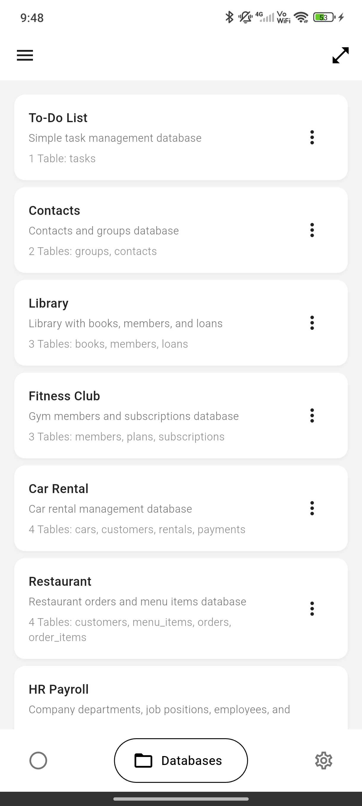
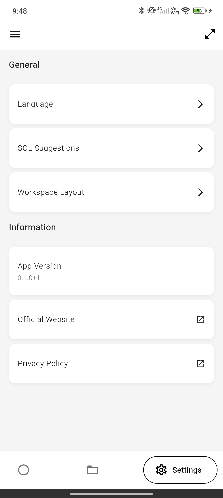
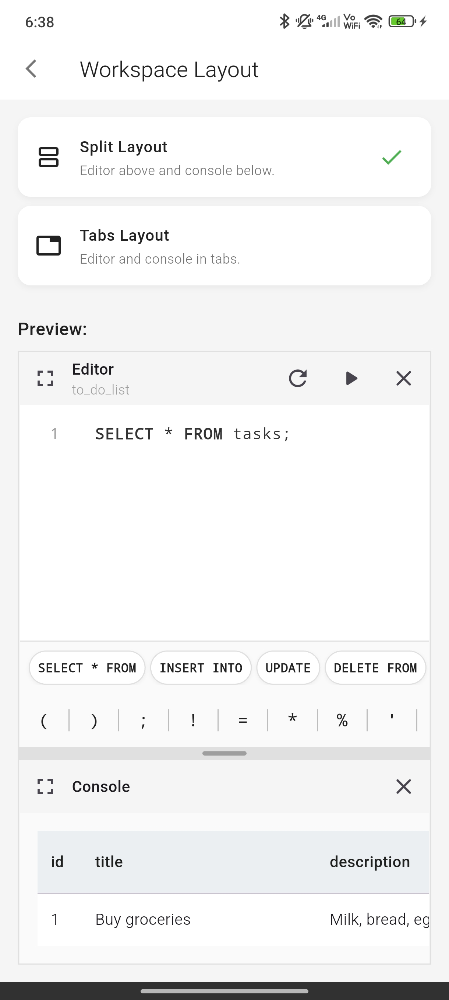
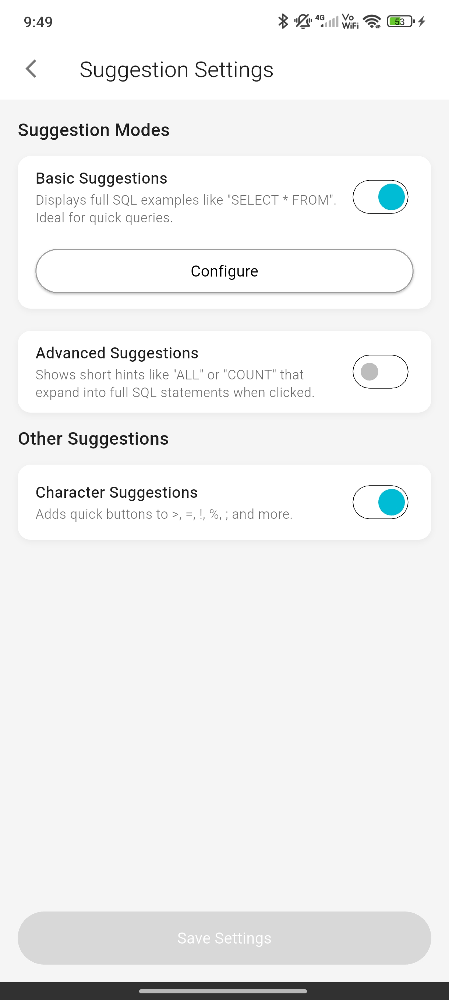
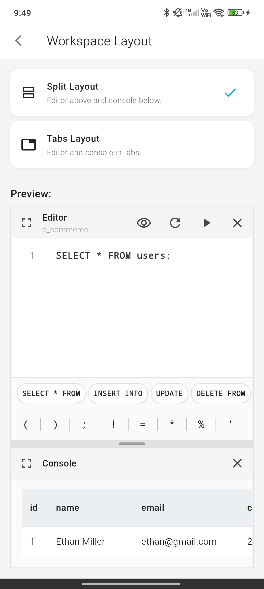

<br>
<div align="center">
  
  
  
  
</div>
<br>

# <p align="center">SQL Studio – Official Website</p>

<p align="center">
Official website of the SQL Studio mobile application, built with Next.js, TypeScript, and Tailwind CSS.  
<br>
<a href="#about-the-project"><strong>Explore the docs »</strong></a>
<br><br>
<a href="https://sql-studio.vercel.app/">View Live Version</a>
·
<a href="https://github.com/dariomatias-dev/sql_studio_web/issues">Report Bug</a>
·
<a href="https://github.com/dariomatias-dev/sql_studio_web/issues">Request Feature</a>
</p>

## Table of Contents

- [About The Project](#about-the-project)
- [Features](#features)
- [Built With](#built-with)
- [Getting Started](#getting-started)
- [Screenshots](#screenshots)
- [Contributing](#contributing)
- [License](#license)
- [Author](#author)

## About The Project

This is the repository for the official website of the SQL Studio mobile app.
Its purpose is to showcase the application, present its main features, display screenshots, and provide a direct download link.

SQL Studio is a mobile application designed to allow users to practice SQL completely and interactively with fully customizable local databases. It uses SQLite (sqflite) as a storage engine, offering an environment for creating, editing, executing, and viewing SQL queries without the need for an internet connection.

> **Note:** This repository contains only the code for the official landing page.

## Features

- **Modern UI/UX:** A clean and responsive landing page to present the application.
- **App Showcase:** Detailed breakdown of the mobile app's capabilities, including:

  - Database Management — Create and manage multiple local SQLite databases.
  - SQL Editor — Write and execute commands (`SELECT`, `INSERT`, `UPDATE`, `DELETE`) with syntax highlighting.
  - Structured Visualization — View tables and records without writing raw SQL.
  - Offline Persistence — All data is stored locally on the device.

- **Responsive Design:** Optimized for desktops, tablets, and mobile devices.

## Built With

This project was developed using the following core technologies:

- **[React](https://reactjs.org/)** – A JavaScript library for building user interfaces.
- **[Next.js](https://nextjs.org/)** – A React framework optimized for performance and SEO.
- **[TypeScript](https://www.typescriptlang.org/)** – A typed superset of JavaScript that compiles to plain JavaScript.
- **[Tailwind CSS](https://tailwindcss.com/)** – A utility-first CSS framework for rapid UI development.
- **[Embla Carousel](https://www.embla-carousel.com/)** – Lightweight and performant carousel library.

## Getting Started

To get a local copy up and running, follow these steps.

### Prerequisites

Ensure you have:

- **Node.js**
- **pnpm**

### Installation

Clone the repository:

```bash
git clone https://github.com/dariomatias-dev/sql_studio_web.git
```

Navigate into the project directory:

```bash
cd sql_studio_web
```

Install the required packages:

```bash
pnpm install
```

### Running The Project

Start the development server:

```bash
pnpm run dev
```

Open **[http://localhost:3000](http://localhost:3000)** in your browser.

## Screenshots

<div align="center">










</div>

## Contributing

Contributions make the open-source community an amazing place to learn and create.
Any contributions you make are greatly appreciated.

To get started:

1. **Fork the Project**
2. **Create your Feature Branch**

   ```sh
   git checkout -b feature/AmazingFeature
   ```

3. **Commit your Changes**

   ```sh
   git commit -m 'Add some AmazingFeature'
   ```

4. **Push to the Branch**

   ```sh
   git push origin feature/AmazingFeature
   ```

5. **Open a Pull Request**

## License

Distributed under the **MIT License**. See the [LICENSE](LICENSE) file for more information.

## Author

Developed by **Dário Matias**:

- **Portfolio**: [dariomatias-dev](https://dariomatias-dev.com)
- **GitHub**: [dariomatias-dev](https://github.com/dariomatias-dev)
- **Email**: [matiasdario75@gmail.com](mailto:matiasdario75@gmail.com)
- **Instagram**: [@dariomatias_dev](https://instagram.com/dariomatias_dev)
- **LinkedIn**: [linkedin.com/in/dariomatias-dev](https://linkedin.com/in/dariomatias-dev)
